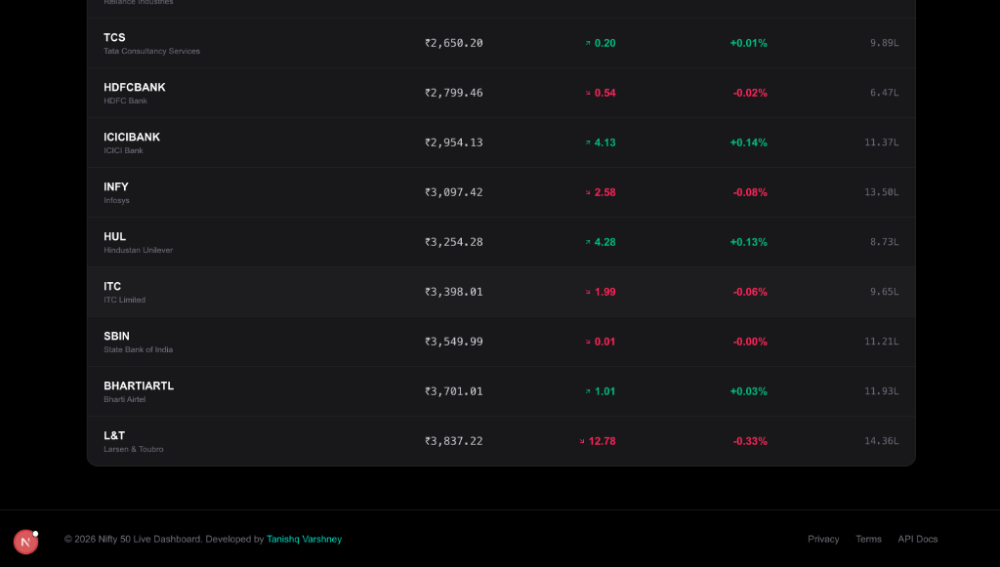
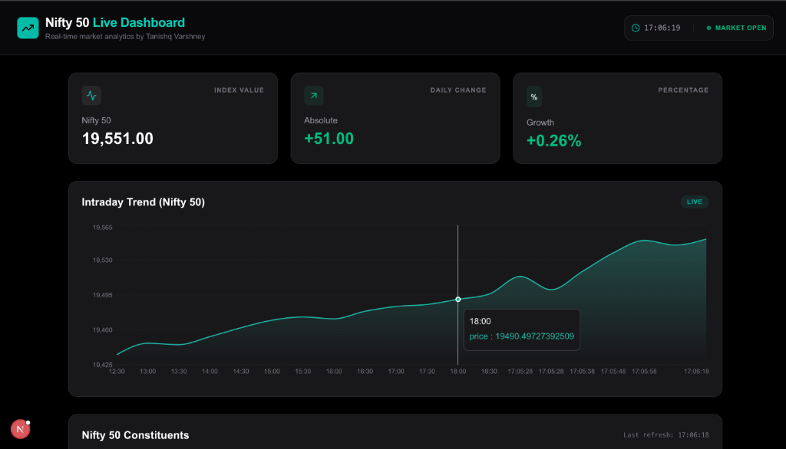

# 📈 Nifty 50 Live Trading Data Dashboard
### Developed by Tanishq Varshney

A modern, high-performance trading dashboard built with **Next.js 14**, **Tailwind CSS**, and **Framer Motion**. This application simulates a real-time market environment with live-updating Nifty 50 stock data, interactive charts, and a premium dark-mode aesthetic.

---

## 🚀 Live Demo Recording
Watch the dashboard in action below!


---

## 📸 Screenshots

### Market Overview & Trend Chart


### Stock Constituents Table


---

## ✨ Features

- **⚡ Real-time Updates**: Data polls every 10 seconds to simulate a live trading floor.
- **📊 Market Overview**: Instant visualization of Nifty 50 Index value, absolute change, and percent change.
- **📑 Dynamic Stock Table**: 
  - Tracks all top Nifty 50 constituents.
  - Interactive sorting by Price, Change, and Volume.
  - Color-coded indicators for green (gainers) and red (losers).
- **📈 Intraday Trend Chart**: Smooth area chart visualizing price movement using **Recharts**.
- **📱 Responsive Design**: Fully optimized for Desktop, Tablet, and Mobile.
- **🎨 Premium UX**: Dark mode first design, smooth transitions, and high-quality typography.

---

## 🛠️ Technical Stack

- **Framework**: Next.js 14 (App Router, TypeScript)
- **Styling**: Tailwind CSS
- **Visuals**: Recharts & Lucide Icons
- **Animations**: Framer Motion
- **State/Fetching**: Axios with custom React Hooks

---

## 🚦 Getting Started

### Prerequisites
- Node.js 18.x or later
- npm or yarn

### Installation
1. Clone the repository:
   ```bash
   git clone https://github.com/tanishqvarshney/Nifty-50-Live-Trading-Data-Dashboard.git
   cd nifty-dashboard
   ```

2. Install dependencies:
   ```bash
   npm install
   ```

3. Start the development server:
   ```bash
   npm run dev
   ```

4. Open [http://localhost:3000](http://localhost:3000) inside your browser.

---

## ☁️ Deployment
This project is optimized for **Vercel**. 

1. Push your code to GitHub.
2. Link the repository to your Vercel project.
3. Click **Deploy**.

---

## 📄 License
This project is for educational purposes only. Market data is simulated for demonstration.
